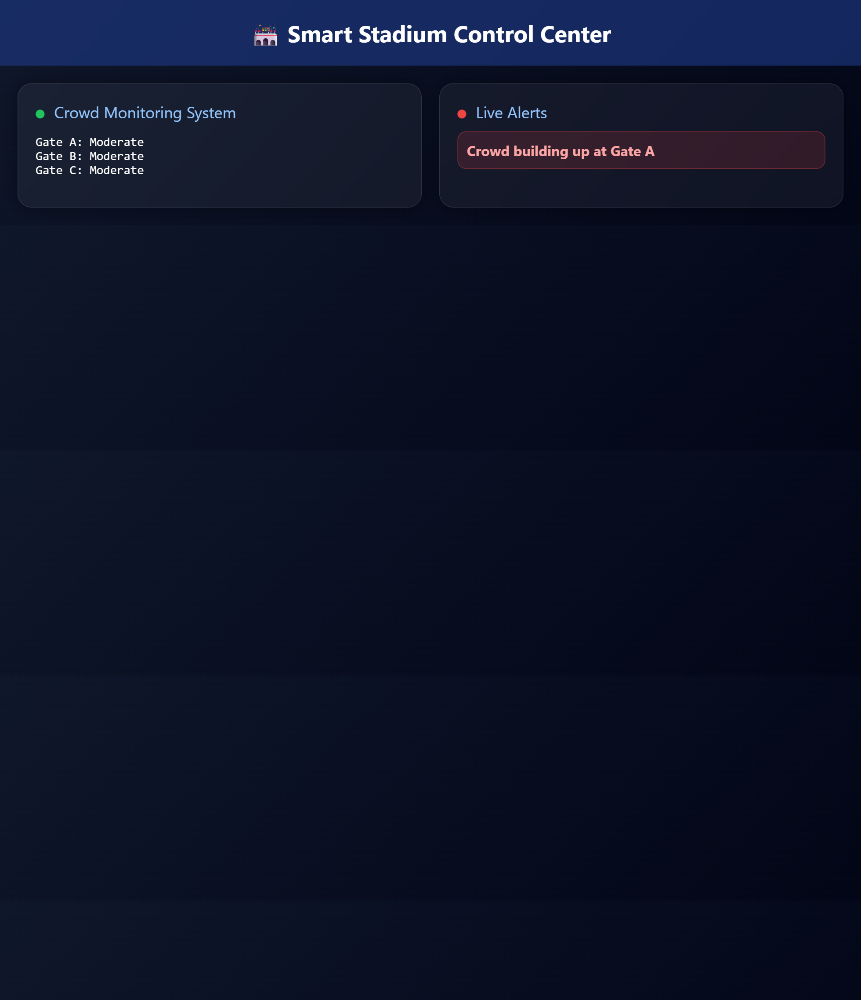
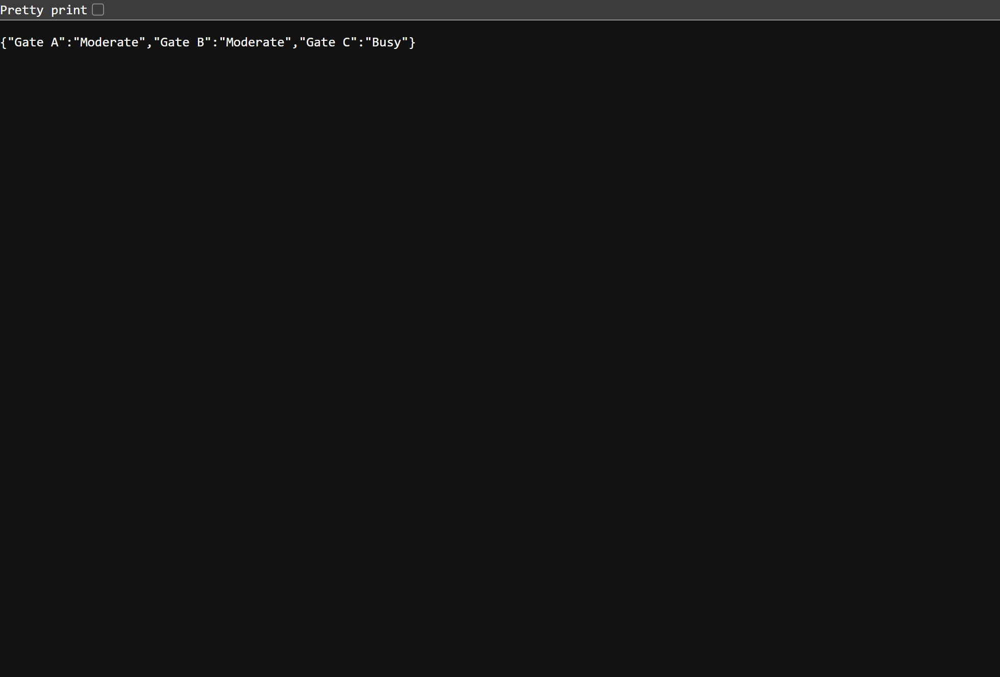

# 🏟️ Smart Event Experience System

## 📌 Problem Statement
Large-scale sporting venues face challenges such as:
- Crowd congestion at entry/exit points
- Long waiting times at gates and facilities
- Poor real-time coordination of attendees

These issues reduce safety, efficiency, and overall attendee experience.

---

## 💡 Solution Overview
The Smart Event Experience System is a web-based platform that improves stadium experiences by:

- Monitoring crowd levels at gates in real time
- Providing smart recommendations for less crowded routes
- Sending live alerts to attendees
- Visualizing crowd data on a dashboard

---

## 🏗️ System Architecture

User (Browser)
↓
Frontend (HTML/CSS/JS Dashboard)
↓
Backend API (Flask - Python)
↓
Crowd Monitoring + Alert Engine

---

## ☁️ Google Cloud Architecture Mapping

This system is designed with Google Cloud in mind:

- Cloud Run → Hosts backend Flask API
- Firestore → Stores crowd movement and event data
- Pub/Sub → Handles real-time alert messaging
- Firebase Hosting → Deploys frontend dashboard

> NOTE: This project demonstrates cloud-native architecture design even when run locally.

---

## 💻 Development Environment

- Built and tested using Google Antigravity IDE
- Version control handled with Git & GitHub
- Local development server used for testing before deployment simulation

---

## ⚙️ How to Run

### Backend
```bash
cd backend
pip install flask flask-cors
python main.py
```

### Frontend
```bash
cd frontend
npx serve .
```

Open:
http://localhost:3000

---

## 🚀 Key Features

- Real-time crowd monitoring simulation
- Dynamic alert generation
- Smart gate recommendations
- Responsive control dashboard UI

---

## 📸 Screenshots

Add your project screenshots here:

```markdown


```

---

## 📎 Repository
https://github.com/Yemmmyc/smart-event-system

---

## 🧠 Final Note
This project demonstrates a scalable smart city event monitoring solution designed for real-world cloud deployment scenarios.
