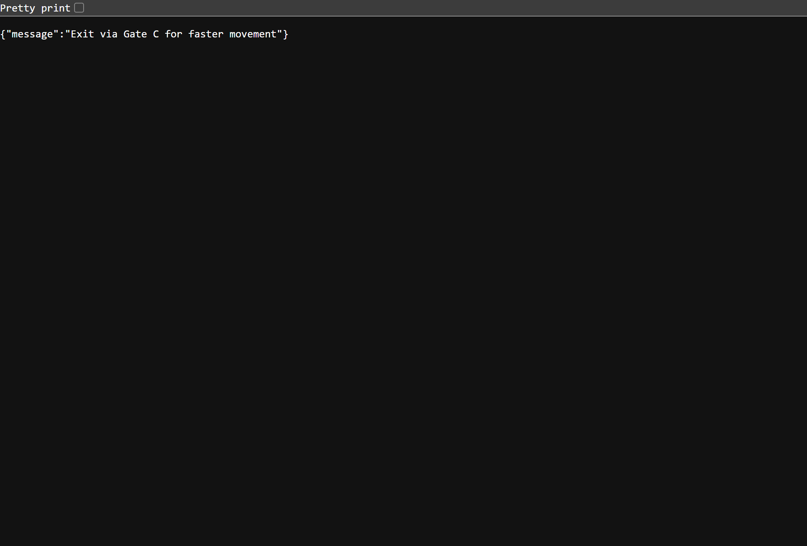

# 🏟️ Smart Event Experience System

## 📌 Problem Statement
Large-scale sporting venues face challenges such as:
- Crowd congestion at entry/exit points  
- Long waiting times at gates and facilities  
- Poor real-time coordination of attendees  

These issues reduce safety, efficiency, and overall attendee experience.

---

## 💡 Solution Overview
The **Smart Event Experience System** is a web-based platform designed to enhance stadium experiences by:

- Monitoring crowd levels at gates in real time  
- Providing smart recommendations for less crowded routes  
- Sending live alerts to attendees  
- Visualizing crowd data on an interactive dashboard  

---

## 🏗️ System Architecture

The system follows a simple client-server architecture:

User (Browser)  
↓  
Frontend Dashboard (HTML, CSS, JavaScript)  
↓  
Flask Backend API (Cloud Run)  
↓  
Crowd Simulation & Alert Engine  

The backend processes requests and dynamically generates crowd insights and alerts.

---
## ☁️ Google Cloud Integration

This project is fully deployed using Google Cloud services:

- **Cloud Run** → Hosts the Flask backend API as a serverless container  
- **Cloud Build** → Automatically builds and deploys the application  
- **Artifact Registry** → Stores the container image  
- **Cloud Logging** → Captures request logs for monitoring and debugging  

### 🔗 Live API
https://smart-event-system-api-107678960097.us-central1.run.app

This ensures the system is scalable, reliable, and accessible from anywhere.

---

### 🚀 Deployment Process

1. Containerized the Flask backend using Docker  
2. Built container using Google Cloud Build  
3. Stored image in Artifact Registry  
4. Deployed service to Cloud Run  
5. Enabled public (unauthenticated) access  

## 🔐 Security

- HTTPS enabled via Cloud Run  
- Controlled CORS access  
- Structured API responses 

## 🧪 Testing

Basic API testing is implemented using Flask’s test client.

Test file:
backend/test_api.py

Tests include:
- Home endpoint response check  
- Crowd endpoint response check  
- Alerts endpoint response check  

Run tests using:
pytest

## ⚡ Efficiency

- Lightweight Flask API  
- Fast JSON responses  
- Optimized endpoint structure  

---

### 🧩 Cloud Architecture Mapping

| Service | Purpose |
|--------|--------|
| Cloud Run | Hosts backend API |
| Cloud Build | Builds Docker container |
| Artifact Registry | Stores container images |
| Firestore *(planned)* | Store crowd/event data |
| Pub/Sub *(planned)* | Real-time messaging |
| Firebase Hosting *(planned)* | Frontend hosting |

---

## 📡 API Endpoints

| Endpoint | Description |
|---------|------------|
| `/` | System status |
| `/crowd` | Crowd level simulation |
| `/alerts` | Smart alert messages |

---

## 💻 Development Environment

- Built using **Google Antigravity IDE**  
- Version control with **Git & GitHub**  
- Tested locally before cloud deployment  

---

## ⚙️ How to Run Locally

### 🔹 Backend
```bash
cd backend
pip install -r requirements.txt
python main.py
```
### 🔹Frontend
```bash
cd frontend
npx serve .
```

Open:
http://localhost:3000

---

## 🧠 Design Considerations

This system is designed with scalability in mind:

- Modular backend structure for easy extension  
- Cloud-native deployment for automatic scaling  
- Stateless API design for performance  
- Ready for integration with real-time data sources (IoT, sensors)  

---

##  🚀 Key Features
📊 Real-time crowd monitoring simulation
🚪 Smart gate recommendations
🔔 Dynamic alert generation
🌐 Cloud-ready backend
⚡ Lightweight and fast UI

---

## 📸 Screenshots

### Dashboard View


### Crowd Status View


### Alerts View


### Main site View


##  🔄 How It Works
User opens the dashboard
Frontend requests data from backend API
Backend simulates crowd conditions
Alerts and recommendations are generated
UI updates dynamically

## ✅ How This Solves the Problem

- Reduces congestion by guiding users to less crowded gates  
- Improves decision-making with real-time alerts  
- Enhances safety through better crowd distribution  
- Provides a scalable foundation for smart event systems 

## 📎 Repository

https://github.com/Yemmmyc/smart-event-system

## 🧠 Future Improvements
Real-time sensor integration (IoT)
AI-based crowd prediction
Persistent database (Firestore)
WebSocket for live updates
Mobile app version

## 🏁 Final Note

This project demonstrates a cloud-native, scalable solution for improving physical event experiences using modern DevOps and Google Cloud technologies.

It is designed to be easily extendable into a production-ready smart stadium system.